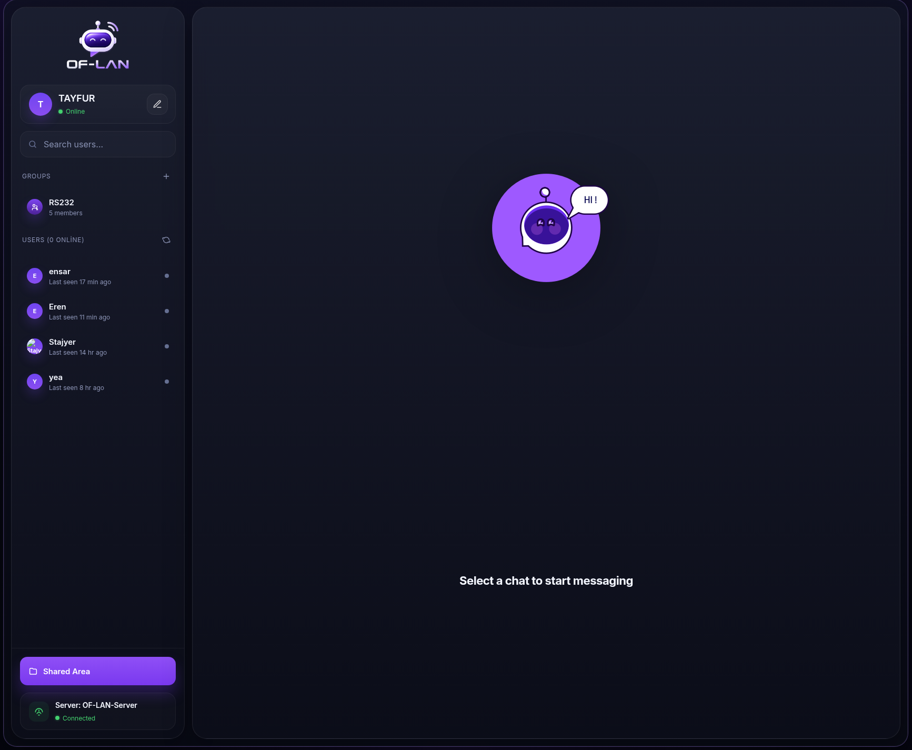
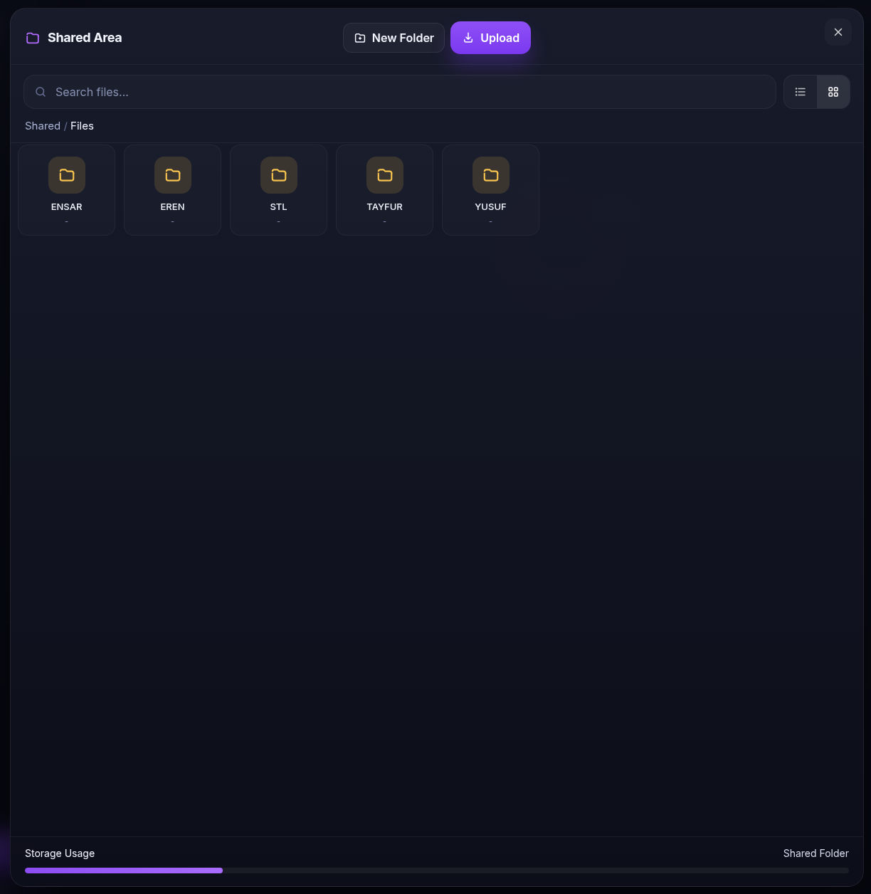
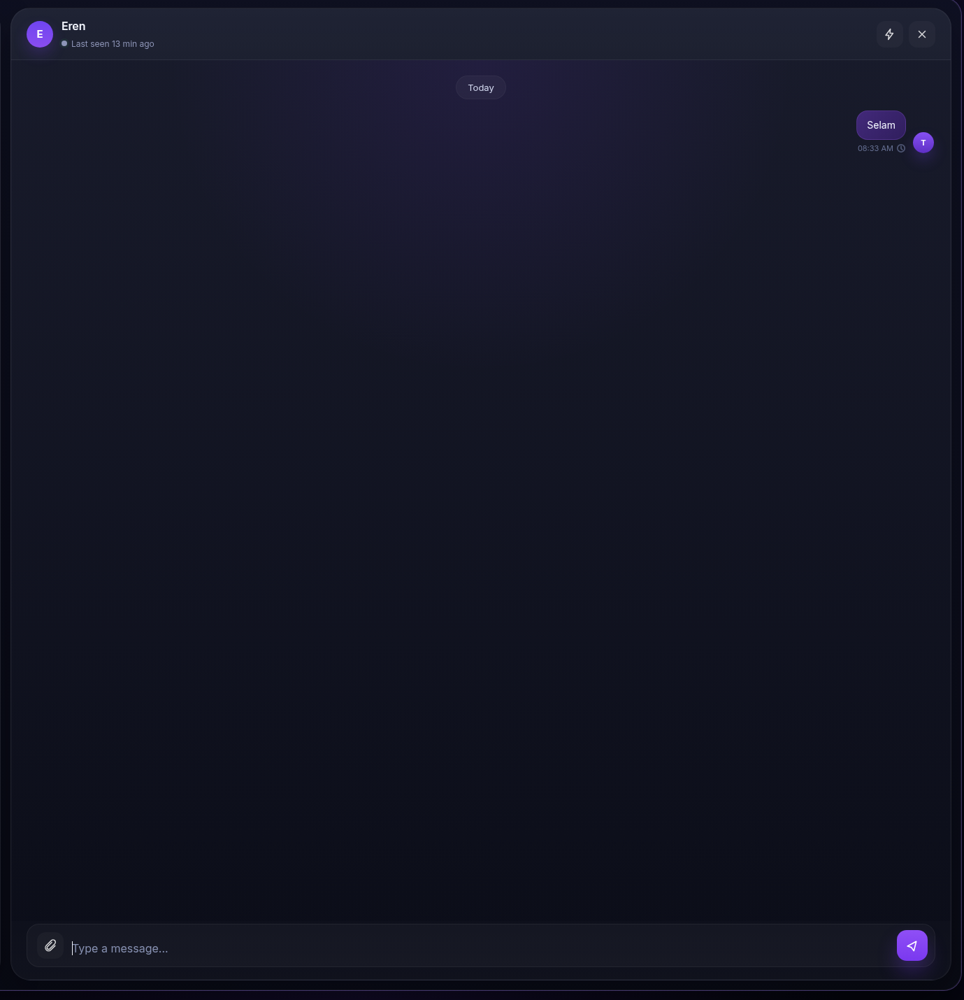

# OF-LAN

OF-LAN is a local network communication and file-sharing platform for LAN-only deployments. It includes real-time direct messages, group chat, shared folders, file uploads, avatar uploads, and an admin workflow for backup, restore, and reset operations.

## Features

- Real-time direct messaging
- Group chat support
- Shared folder browsing
- File upload and download
- Avatar upload
- mDNS / Bonjour hostname advertising
- Backup and restore from the admin panel
- Database and upload reset support
- Systemd-friendly server deployment

## Screenshots

### Main interface



### Shared files



### Chat view



## Requirements

- Node.js 22 or newer
- npm
- Linux is recommended for port `80` binding and systemd deployment

## Installation

```bash
npm install
```

## Running the application

```bash
npm start
```

The application listens on port `80` by default. On Linux, you may need elevated privileges:

```bash
sudo npm start
```

The default `start` script enables mDNS advertising, so `npm start` is enough to publish the app as `oflan.local` when the network supports Bonjour / mDNS.

## Environment variables

You can override the bind host, port, and advertised hostname:

```bash
PORT=8080 OFLAN_BIND_HOST=0.0.0.0 OFLAN_HOSTNAME=oflan.local npm start
```

Available variables:

- `PORT` - HTTP port to listen on
- `OFLAN_BIND_HOST` - bind address, defaults to `0.0.0.0`
- `OFLAN_ENABLE_MDNS` - set to `1` to enable Bonjour / mDNS advertising
- `OFLAN_HOSTNAME` - advertised hostname, defaults to `oflan.local`
- `OFLAN_SERVICE_NAME` - Bonjour service name, defaults to `OF-LAN`

## Access

- Local hostname: `http://oflan.local`
- Direct LAN IP: `http://<server-ip>`

## Systemd service

For server deployments, the recommended service name is `of-lan.service`.

Suggested unit settings:

- `WorkingDirectory=/home/user/of-lan`
- `ExecStart=/usr/bin/node server.js`
- `Environment=PORT=80`
- `Environment=OFLAN_ENABLE_MDNS=1`
- `User=user`

After editing the unit file:

```bash
sudo systemctl daemon-reload
sudo systemctl restart of-lan
sudo systemctl status of-lan
```

## Demo assets

The `demo/` directory contains documentation assets and screenshots.

Recommended filenames:

- `demo/main-screen.png`
- `demo/shared-area.png`
- `demo/chat-view.png`

Use this folder for:

- README screenshots
- release notes
- presentation material
- onboarding documents

## Backup and restore

The admin panel can export and restore persistent application data.

### Backup

1. Open the admin panel and sign in.
2. Click `Backup`.
3. The app downloads a `.tar.gz` archive containing:
   - `data/`
   - `uploads/`

### Restore

1. Open the admin panel and sign in.
2. Click `Restore`.
3. Select a `.tar.gz` or `.tgz` archive.
4. Restart the server to apply the staged restore.

### Reset

The admin panel also supports a reset flow that clears the database and uploads on the next restart.

Important notes:

- Restore replaces the current `data/` and `uploads/` directories.
- Keep a copy of any files you still need before restoring.
- Restart the server after staging a restore or reset.

## Notes

- If `oflan.local` does not resolve on a client device, use the server IP directly or verify that Bonjour / mDNS is supported on the network.
- Persistent data is stored in `data/`.
- Uploaded files are stored in `uploads/`.
- Upload errors are often caused by filesystem permissions on `uploads/` or `data/`.

